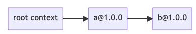
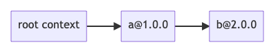
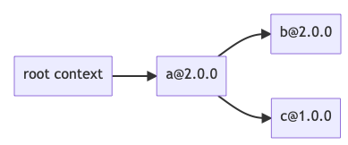

# Artifact

- [Artifact](#artifact)
  - [Building the Container Image for the Artifact](#building-the-container-image-for-the-artifact)
  - [Welcome](#welcome)
    - [How to read this document](#how-to-read-this-document)
  - [Running the Docker Image](#running-the-docker-image)
  - [Example #1: Checking that MaxNPM Runs Correctly](#example-1-checking-that-maxnpm-runs-correctly)
  - [Example #2: Using MaxNPM With Different Consistency Criteria](#example-2-using-maxnpm-with-different-consistency-criteria)
  - [Example #3: MaxNPM can Allow or Disallow Cyclic Solutions](#example-3-maxnpm-can-allow-or-disallow-cyclic-solutions)
  - [Example #4: MaxNPM can Find Solutions when NPM Fails](#example-4-maxnpm-can-find-solutions-when-npm-fails)
  - [Example #5: MaxNPM can Minimize Oldness](#example-5-maxnpm-can-minimize-oldness)
  - [Example #6: MaxNPM can Minimize Number of Dependencies](#example-6-maxnpm-can-minimize-number-of-dependencies)
  - [Example #7: MaxNPM can Minimize Number of Vulnerable Dependencies](#example-7-maxnpm-can-minimize-number-of-vulnerable-dependencies)
  - [Running the Experiments of the Evaluation Section](#running-the-experiments-of-the-evaluation-section)

## Building and Loing to the Container Image for the Artifact

To build the container image:

1. Download Docker engine from https://docs.docker.com/engine/install/ or your package manager of choice
2. Locate the Dockerfile in this directory (`artifact` directory in the PacSolve repository)
3. Run `docker build -t pacsolve-artifact .` in the command line while being in the same directory as the Dockerfile
4. Run `docker exec -it pacsolve-artifact bash` to log into the container

## Welcome

Welcome to the virtual machine which we have prepared to illustrate the functionality of PacSolve and MaxNPM.

**General layout of the artifact**: All of the code is in the directory `/home/artifact`. Within that directory, the following sub-directories are of interest:

- `pacsolve/arborist/` and `pacsolve/npm/` contain the source code of our fork of NPM, which have been modified to solve dependencies by invoking PacSolve.
- `pacsolve/RosetteSolver/` contains the source code of PacSolve, which implements a flexible dependency solving backend via translation to Max-SMT by using Rosette.

### How to read this document

The rest of this document will proceed by following the series of examples contained in `artifact/`, to gain an understanding of how MaxNPM functions on examples. **Every single command** which you are required to run will be annotated with a Step Number, some shell commands, and a possible box describing the expected command results, like so:

**Step 0:**

```bash
echo "example"
```

> Expected result: should print 'example' to the terminal

Finally, the very end of this document explains the steps necessary to re-run the full experiments conducted in the evaluation section.
However, running these experiments takes quite a long compute time (several days).

## Running the Docker Image

**Step 1:**
To run the image, type this command in your command line:

```bash
docker run -it --entrypoint bash pacsolve-artifact
```

From here on out, all commands will be run inside this shell.

## Example #1: Checking that MaxNPM Runs Correctly

As a first example, we solve a trivial dependency example to verify that everything runs as expected,
and to introduce the basic concepts for how to run MaxNPM and how to compare outputs with vanilla NPM.

The scenario of the first example is described in this table:

| Package      | Dep 1  |
| ------------ | ------ |
| root context | `a: *` |
| `a@1.0.0`    |        |

meaning that the root solving context has a single dependency on any version of `a`, and `a` version 1.0.0 (the only version) has no dependencies.
For your reference, the directories inside `ex1_maxnpm_runs/` encode this scenario with NPM packages which have already been uploaded to `npmjs.com`.
As an example, package `a` version `1.0.0` is described by `ex1_maxnpm_runs/a@1.0.0/package.json`, and has already been published as
`@minnpm-artifact-examples/ex1-a` ([link](https://www.npmjs.com/package/@minnpm-artifact-examples/ex1-a)).

There is only one possible solution for this example, which is:


Let's check that both vanilla NPM and MaxNPM find this solution.

**Step 2:**

```bash
pushd ex1_maxnpm_runs/root_context
```

**Step 3:**

```bash
# Install packages with vanilla NPM
npm install
# Save the resulting lockfile, then clear solve results
cp node_modules/.package-lock.json result-vanilla.json; rm -rf node_modules package-lock.json
```

> Expected result: the install command should succeed. If not, please verify / fix internet connectivity within the container.

**Step 4:**

```bash
# Install packages with MaxNPM
maxnpm install --maxnpm
# or (--maxnpm and --rosette are equivalent as of now)
maxnpm install --rosette

# Save the resulting lockfile, then clear solve results
cp node_modules/.package-lock.json result-naxnpm.json; rm -rf node_modules package-lock.json
```

> Expected result: the install command should succeed.

**Step 5:**

```bash
# Look at both results
tail -n +1 result-*.json
```

> Expected result: both result files should describe the solution graph drawn above.
> Specifically, the `packages` field contains a dictionary listing all solved dependencies.
> There should be one solved dependency: `node_modules/@minnpm-artifact-examples/ex1-a`, version `1.0.0`.
> Note that one file may lack tarball URLs, but this does not affect functionality.

Running both the `npm`, `cp` and `rm` and `tail` commands each time is tedious, so we have included a script to automate this.
Let's repeat the above example by using the `compare_solvers` script:

**Step 6:**

```bash
compare_solvers vanilla maxnpm='--maxnpm'
```

> Expected result: both install commands should succeed, and `result-vanilla.json` and `result-maxnpm.json` should be produced just as when done manually.

**Step 7:**

```bash
popd
```

## Example #2: Using MaxNPM With Different Consistency Criteria

We now demonstrate that MaxNPM can be configured to use 3 different consistency policies (NPM, Cargo, and PIP-style).

The scenario to solve in this example is precisely that of Figure 1 in the paper, which is summarized in the following table:

| Package       | Dep 1       | Dep 2         |
| ------------- | ----------- | ------------- |
| root context  | `debug: *`  | `ms: < 2.1.2` |
| `debug@4.3.4` | `ms: 2.1.2` |               |
| `ms@1.0.0`    |             |               |
| `ms@2.1.0`    |             |               |
| `ms@2.1.2`    |             |               |

There is a potential conflict because `root context` and `debug@4.3.4` cannot agree on a version of `ms`.
MaxNPM exposes 3 different polices for conflicts:

1. (NPM's policy): Freely allow co-installation of multiple versions, yielding this solution graph:

   

2. (Cargo's policy): Allow co-installation of versions which are **not** SemVer compatible. In this case, `ms@2.1.2` can be co-installed with `ms@1.0.0` but **not** `ms@2.1.0`, yielding this solution graph:

   

3. (PIP's policy): Disallow co-installation of multiple versions, yielding unsatisfiable constraints in this example.

Let's now observe MaxNPM performing these solves in practice.

**Step 8:**

```bash
pushd ex2_consistency_criteria/root_context
```

**Step 9:**

```bash
compare_solvers \
    vanilla \
    maxnpm-npm='--maxnpm --consistency npm' \
    maxnpm-cargo='--maxnpm --consistency cargo' \
    maxnpm-pip='--maxnpm --consistency pip'
```

> Expected result: All solves except `maxnpm-pip` should succeed.
> The `result-vanilla.json` and `result-maxnpm-npm.json` files should both contain the solution graph of policy (1) above,
> and `result-cargo.json` should contain the solution graph of policy (2) above.
> When reading the result files, the solution graph node for `ms` contained inside `debug` is notated by its key being a subdirectory of `debug`.

**Step 10:**

```bash
popd
```

## Example #3: MaxNPM can Allow or Disallow Cyclic Solutions

On Page 13, _Incompleteness of Cargo_ presents an example demonstrating a dimension in which Cargo is not a complete solver,
because of its non-backtracking behavior when enforcing acyclic solutions.
We present that example here (slightly simplified) to show how MaxNPM (backed by PacSolve)
can be configured to either allow or disallow cycles without sacrificing completeness.

The scenario to solve is:

| Package      | Dep 1      |
| ------------ | ---------- |
| root context | `a: *`     |
| `a@1.0.0`    |            |
| `a@2.0.0`    | `b: *`     |
| `b@1.0.0`    | `a: 2.0.0` |

There are exactly 2 solution graphs which satisfy this example, one with cycles and one without:


Let's try solving it both ways.

**Step 11:**

```bash
pushd ex3_cycles/root_context
```

**Step 12:**

```bash
# MaxNPM allows cycles by default, the flag
# --disallow-cycles tells MaxNPM to only look for acyclic solutions.
compare_solvers \
    maxnpm='--maxnpm' \
    maxnpm-acyclic='--maxnpm --disallow-cycles'
```

> Expected result: All solves should succeed.
> The `result-maxnpm.json` file should contain the cyclic solution graph.
> The cycle is notated by `b@1.0.0` having as a child a special link type (`"link" : true`), with a `resolved` field indicating the link destination.
> In this example the link destination is `a@2.0.0`.
> The `result-maxnpm-acyclic.json` file should contain the acyclic solution graph.

Note that MaxNPM prefers to choose the cyclic solution graph because it produces newer versions of dependencies.

**Step 13:**

```bash
popd
```

## Example #4: MaxNPM can Find Solutions when NPM Fails

On Pages 12-13, _Incompleteness of NPM_ presents an example demonstrating a dimension in which NPM is not a complete solver,
because it does not perform backtracking. When encountering an unsatisfiable constraint, NPM fails, whereas MaxNPM can still
find a satisfying solution graph. For this example the scenario to solve is:

| Package      | Dep 1      |
| ------------ | ---------- |
| root context | `a: *`     |
| `a@1.0.0`    |            |
| `a@2.0.0`    | `b: 9.9.9` |
| `b@1.0.0`    |            |

There is no solution graph in which the root context depends on `a@2.0.0`. The only solution graph is:


Let's try solving with both vanilla NPM and MaxNPM.

**Step 14:**

```bash
pushd ex4_npm_incomplete/root_context
```

**Step 15:**

```bash
compare_solvers \
    vanilla \
    maxnpm='--maxnpm'
```

> Expected result: The MaxNPM solve should succeed, and the NPM solve should fail.
> The `result-maxnpm.json` file should contain the solution graph drawn above.

**Step 16:**

```bash
popd
```

## Example #5: MaxNPM can Minimize Oldness

MaxNPM finds globally optimal solution graphs, for some chosen minimization criteria. To see this in action, consider this scenario to solve:

| Package      | Dep 1      | Dep 2      |
| ------------ | ---------- | ---------- |
| root context | `a: *`     |            |
| `a@1.0.0`    | `b: 2.0.0` | `c: 2.0.0` |
| `a@2.0.0`    | `b: 1.0.0` | `c: 1.0.0` |
| `b@1.0.0`    |            |            |
| `b@2.0.0`    |            |            |
| `c@1.0.0`    |            |            |
| `c@2.0.0`    |            |            |

There are exactly 2 possible solution graphs, corresponding to which version of `a`:


The first solution graph has an old version of `a`, but new versions of `b` and `c`. The second graph has a new version of `a`, but old versions of `b` and `c`.
Let's try using MaxNPM to minimize the total oldness in the solution.

**Step 17:**

```bash
pushd ex5_min_oldness/root_context
```

**Step 18:**

```bash
# By default, MaxNPM minimizes the total oldness in the solution, so
# we don't need to specify any additional flags.
compare_solvers \
    vanilla \
    maxnpm='--maxnpm'
```

> Expected result: both solves should succeed.
> The `result-vanilla.json` file should contain the solution graph with (`a@2.0.0`; `b@1.0.0`; `c@1.0.0`),
> and the `result-maxnpm.json` file should contain the solution graph with (`a@1.0.0`; `b@2.0.0`; `c@2.0.0`)

**Step 19:**

```bash
popd
```

## Example #6: MaxNPM can Minimize Number of Dependencies

MaxNPM can also be configured to minimize the total number of dependencies in the solution graph.
Consider solving this situation:

| Package      | Dep 1  | Dep 2  |
| ------------ | ------ | ------ |
| root context | `a: *` |        |
| `a@1.0.0`    | `b: *` |        |
| `a@2.0.0`    | `b: *` | `c: *` |
| `b@1.0.0`    |        |        |
| `b@2.0.0`    |        |        |
| `c@1.0.0`    |        |        |

There are exactly 4 possible solution graphs, corresponding to which versions of `a` and `b`:








The first two solution graphs have an old version of `a`, but one fewer dependency.
By default MaxNPM prefers to choose the newer version of `a`,
but we can configure its minimization criteria to prioritize getting fewer dependencies.

**Step 20:**

```bash
pushd ex6_min_num_deps/root_context
```

**Step 21:**

```bash
# The default value for --minimize if unspecified is:
# --minimize min_oldness,min_num_deps
compare_solvers \
    vanilla \
    maxnpm-min-oldness-then-num-deps='--maxnpm' \
    maxnpm-min-num-deps-then-oldness='--maxnpm --minimize min_num_deps,min_oldness'
```

> Expected result: all solves should succeed.
> The `result-vanilla.json` and `result-maxnpm-min-oldness-then-num-deps.json` files and should contain the solution graph with (`a@2.0.0`; `b@2.0.0`; `c@1.0.0`),
> and the `result-maxnpm-min-num-deps-then-oldness.json` file should contain the solution graph with (`a@1.0.0`; `b@2.0.0`)

Note that because we minimize `min_oldness` at second priority, we get a solution with `b@2.0.0` rather than `b@1.0.0`, as that does not affect graph size.

**Step 22:**

```bash
popd
```

## Example #7: MaxNPM can Minimize Number of Vulnerable Dependencies

MaxNPM can be configured to minimize the total sum [CVSS](https://nvd.nist.gov/vuln-metrics/cvss) score of all dependencies in a solution graph.

We take a version range of jQuery as an example: `"jquery": "jquery": "^1.8.3 || ^2.0"`  
and we take a list of vulnerable version ranges with their CVSS "badness" score (taken from the [GitHub Advisory Database](https://github.com/advisories)):
| Range | CVSS |
| ------------ | ------ |
| `>= 1.7.1 <= 1.8.3` | `7.95` |
| `< 1.9.0` | `6.1` |
| `>= 1.2 < 3.5.0` | `6.9` |
| `>= 1.0.3 < 3.5.0` | `6.9` |
| `< 3.4.0` | `6.1` |
| `> 2.1.0, < 3.0.0` | `7.5` |
| `< 3.0.0` | `6.1` |

Given these ranges, the optimal solution in the required version range of `^1.8.3 || ^2.0` is some version in the range of `> 1.9.0 < 2.1.0`, as that would give us with a total CVSS score of `26.0`.  
Vanilla npm would choose the latest version of the package in that range (`2.2.4`), and `npm audit` will show **1** non-fixable (unless `--force` is enabled) high severity vulnerability, despite having 5 vulnerabilities at a total CVSS score of `33.5`.  
Meanwhile, MaxNPM is able to choose the optimal solution with the `min_cve` or `min_cve,min_oldness` minimization objective, and give us a total CVSS score of `26.0`.  

**Step 23**

```bash
pushd ex7_min_cve/
```

**Step 24**
```bash
# first, we install with vanilla npm
npm install

# save the lockfile
cp node_modules/.package-lock.json result-vanilla.json; rm -rf node_modules package-lock.json

# then we install with maxnpm minimizing only min_cve
maxnpm install --maxnpm --minimize min_cve

# save the lockfile
cp node_modules/.package-lock.json result-min_cve.json; rm -rf node_modules package-lock.json

# finally, we install the package with both min_cve and min_oldness objectives
maxnpm install --maxnpm --minimize min_cve,min_oldness

# save the lockfile
cp node_modules/.package-lock.json result-min_cve-min_oldness.json; rm -rf node_modules package-lock.json
```

**Step 25**
```bash
# now we check and compare the results for each installation
get_cvss result-vanilla.json

get_cvss result-min_cve.json

get_cvss result-min_cve-min_oldness.json
```

**Step 26**
```bash
popd
```

## Running the Experiments of the Evaluation Section

Finally, this container can also be used to reproduce the experimental results of evaluation section of the paper.

**Note: reproducing the experimental results within this container will take 3-10 days of compute. Proceed only if you wish!**

We will not perfectly reproduce the results, particularly performance results, due to limited time and compute resources and variation from the machines on which we ran the reported experiments.

First, we clear any existing experimental data. This deletes all the directories `/home/artifact/experiment-dir*/`:

**Step 27:**

```bash
# Clear any existing experiment data
delete_experiment
```

Now, we can run the main experiment, which will run NPM and MaxNPM (in many configurations) on 1000 packages. Note that the paper used
a timeout of 600 seconds, but in order to get results sooner we decrease the timeout to 60 seconds:

**Step 28:**

```bash
# This takes about 2-3 days
run_experiment 60 top1000_comparison
```

To verify that the experiments ran, you can check that the directory `/home/artifact/experiment-dir` exists, and poke at the contents.
If you believe that some of the experiments may have failed spuriously (for example due to a network disconnection), you can simply
re-run `run_experiment 60`, and it will re-run only previously failed ones.

Next, we can run the performance measurement experiment:

**Step 29:**

```bash
# This takes about 4 hours
run_perf top1000_comparison
```

To verify that the performance experiments ran, you can check that the directory `/home/artifact/experiment-dir-perf` exists and contains 2 `.csv` files.

Now that all experiments have finished running, we perform some pre-analysis data collection:

**Step 30:**

```bash
# This takes about 30-60 minutes
prepare_analysis top1000_comparison
```

To verify that this step succeeded, you can check that the following files / directories exist:

- `/home/artifact/experiment-dir/results.csv`
- `/home/artifact/experiment-dir-oldness/*.csv`
- `/home/artifact/experiment-dir-sizes/*.tsv`

Finally, we can produce the figures and tables:

**Step 31:**

```bash
# This is very fast
save_analysis top1000_comparison
```

Then, the following directories contain the topline numbers, plots, and tables corresponding to what is reported in the paper:

- `/home/artifact/number-results/`
- `/home/artifact/plots/`
- `/home/artifact/tables/`


Note that some differences are expected: 1) some results, in particular the performance results and the number of timeouts will be different, as explained above. 2) the tables are formatted a bit differently, with some re-arranged out commented-out rows in the verbatim paper tables.  

To run the vulnerability analysis evaluation, re-run the commands in this section but substitute `top1000_comparison` with `vuln_tarballs`
